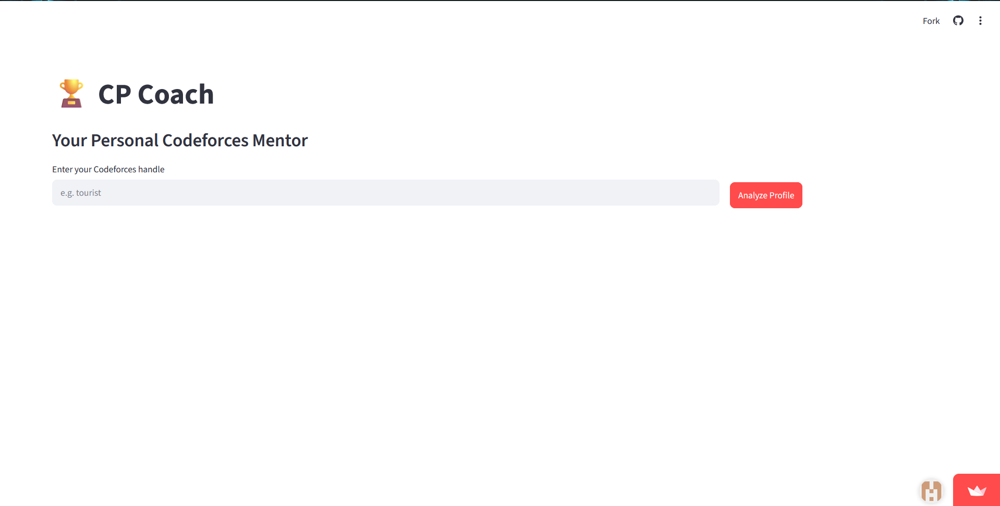
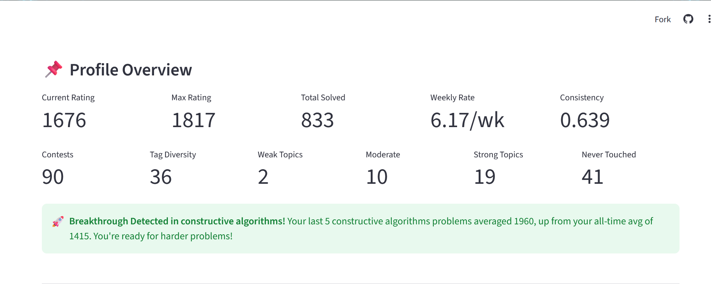
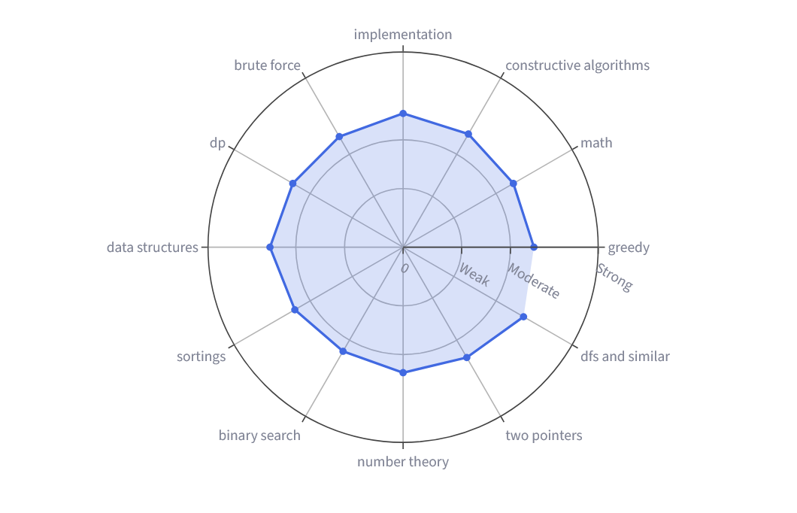
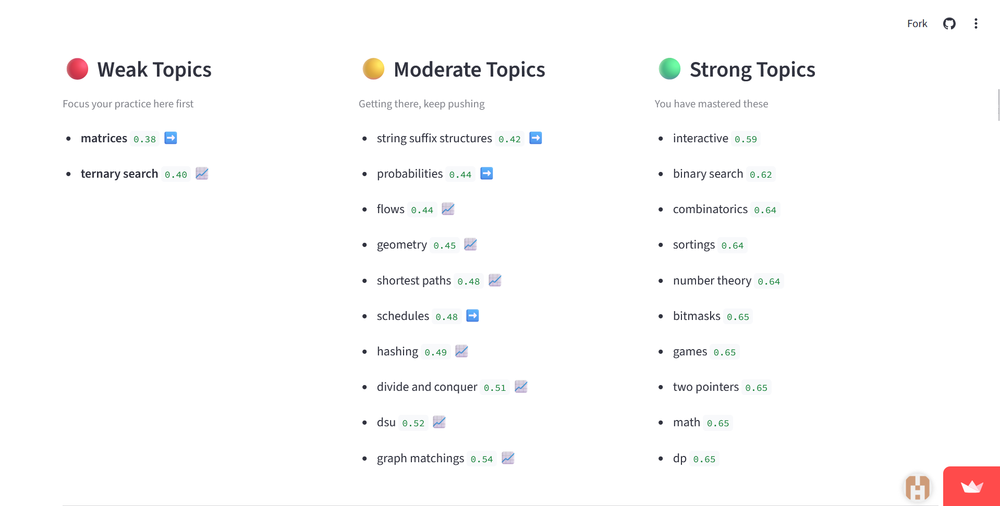
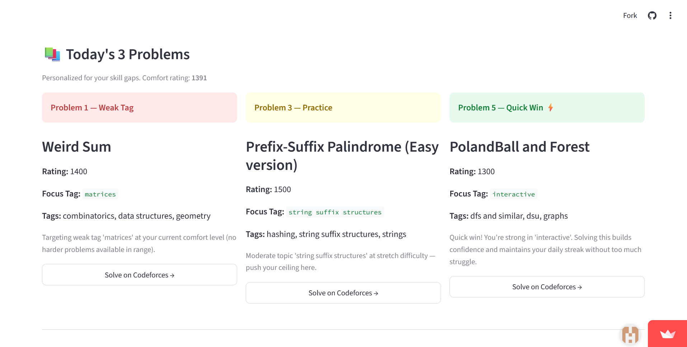
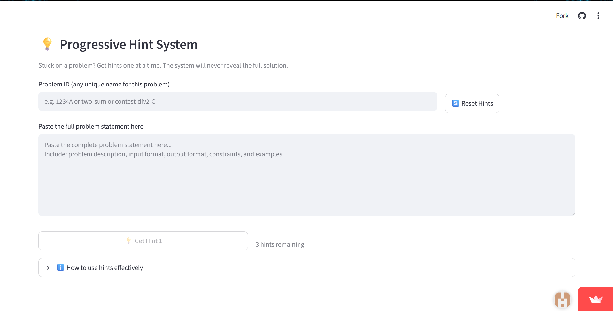

# 🏆 LevelUp CP — AI-Powered Competitive Programming Coach

An end-to-end ML system that analyzes your Codeforces profile to detect 
skill gaps, predict rating growth, and deliver personalized coaching.

## 🚀 Live Demo

👉 https://levelup-cp-1812.streamlit.app/

Enter any Codeforces handle and get your complete coaching dashboard instantly.

## 🖥️ Screenshots

### Dashboard Overview

  
  

---

### Skill Radar Chart & Topic Analysis

  
  

---

### Daily Problem Recommendations

  

---

### Progressive Hint System

  

## ✨ Features

### 📊 Skill Analysis
- 8-feature per-tag scoring system
- Weak / Moderate / Strong / Never Touched classification
- Momentum detection (improving vs declining per topic)
- Stagnation detection
- Skill radar chart visualization

### 📈 Rating Prediction
- Predicts rating after 3 and 6 months
- Shown as honest range (e.g. 1380–1620) not fake exact number
- SHAP-based explanations of what is driving prediction
- Actionable suggestions to improve predicted rating

### 🎯 Problem Recommendations
- Daily 3 personalized problems (weak tag strategy)
- Prerequisite-aware topic dependency graph (60+ topics)
- 9 curated mastery paths at progressive difficulty
- Struggled problem detector (3+ WA/TLE patterns)
- Unsolved contest problem finder

### 💡 AI Coaching (Gemini API)
- Progressive hint system (3 hints, never full solution)
- Hints persist across browser sessions via PostgreSQL

## 🛠️ Tech Stack

| Layer          | Technology                    |
|----------------|-------------------------------|
| Frontend       | Streamlit                     |
| Backend        | FastAPI                       |
| Database       | PostgreSQL (Supabase)         |
| ML Models      | XGBoost, scikit-learn         |
| Explainability | SHAP                          |
| LLM            | Google Gemini API             |
| Data Source    | Codeforces Public API         |
| Deployment     | Render (backend), Streamlit Cloud (frontend) |
| Language       | Python 3.12                   |

## 🏗️ Architecture

User → Streamlit Frontend
              ↓
       FastAPI Backend (Render)
              ↓
    ┌─────────┼─────────┐
    ↓         ↓         ↓
Supabase  Codeforces  Gemini
  (DB)      API        API

## 🤖 ML Models

### Rating Prediction Model
- Algorithm: XGBoost Regression
- Training data: 5,000+ labeled snapshots from 1,000+ CF users
- Features: current rating, solve rate per week, tag diversity,
  avg problem rating, contest frequency, consistency score,
  weak tag count, rating volatility, recent performance
- Evaluation: 5-fold cross-validation
- MAE: 122 ± 6 rating points
- Output: shown as range (predicted ± MAE) not a fake exact number

### Skill Classifier
- 8 features computed per topic tag from submission history
- 7-weight composite scoring formula
- Classifies: Weak / Moderate / Strong / Never Touched
- Momentum: recent avg rating vs all-time avg rating

## 📦 Data Pipeline

1. Fetch user submissions, rating history, and problem metadata
   via Codeforces public API
2. Parse and structure 10,000+ submissions per user
3. Compute 8 features per topic tag
4. Cache 9,000+ CF problems locally for sub-second filtering
5. Store everything in PostgreSQL on Supabase

## ⚙️ How It Works

1. Enter your Codeforces handle
2. System fetches all your submissions and contest history
3. ML model analyzes 8 features per topic tag
4. Topics classified as Weak, Moderate, Strong, or Never Touched
5. XGBoost model predicts your rating in 3 and 6 months
6. Recommendation engine picks 3 daily problems targeting your gaps
7. Gemini AI gives progressive hints when you're stuck

## 📁 Project Structure

cp-coach/
├── backend/
│   ├── api/routes.py          # FastAPI endpoints
│   ├── ml/
│   │   ├── skill_analysis.py  # Skill profiling
│   │   ├── rating_predictor.py # XGBoost model
│   │   └── recommender.py     # Recommendation engine
│   ├── llm/hints.py           # Gemini hint system
│   ├── data/
│   │   ├── cf_api.py          # Codeforces API wrapper
│   │   └── data_processor.py  # Feature engineering
│   └── db/models.py           # PostgreSQL models
├── frontend/app.py            # Streamlit dashboard
├── models/                    # Trained .pkl files
├── notebooks/                 # Jupyter exploration
└── data_collection/           # Training data pipeline

## 🖥️ Running Locally

### Prerequisites
- Python 3.12+
- PostgreSQL
- Codeforces account (for API access)
- Google Gemini API key

### Setup

# Clone the repo
git clone https://github.com/harsh-kakadiya1812/LevelUp-CP
cd LevelUp-CP

# Create virtual environment
python -m venv venv
venv\Scripts\activate   # Windows
source venv/bin/activate # Mac/Linux

# Install dependencies
pip install -r requirements.txt

# Set up environment variables
# Create .env file with:
DATABASE_URL=your_postgresql_url
GEMINI_API_KEY=your_gemini_key

# Start backend
cd backend
uvicorn main:app --reload

# Start frontend (new terminal)
cd frontend
streamlit run app.py

## 🔐 Environment Variables

| Variable       | Description                    | Where to Get        |
|----------------|--------------------------------|---------------------|
| DATABASE_URL   | PostgreSQL connection string   | Supabase dashboard  |
| GEMINI_API_KEY | Google Gemini API key          | aistudio.google.com |

## 📊 Model Performance

| Metric              | Value                    |
|---------------------|--------------------------|
| Algorithm           | XGBoost Regression       |
| Training samples    | 5,000+                   |
| Unique users        | 1,000+                   |
| Cross-validation    | 5-fold                   |
| MAE (3-month)       | 122 ± 6 rating points    |
| Prediction format   | Range (e.g. 1380–1620)   |

## 🌐 Deployment

| Service         | Platform        | URL                                    |
|-----------------|-----------------|----------------------------------------|
| Frontend        | Streamlit Cloud | levelup-cp.streamlit.app               |
| Backend API     | Render          | levelup-cp-api.onrender.com            |
| Database        | Supabase        | PostgreSQL (cloud hosted)              |
| API Docs        | FastAPI/Swagger | levelup-cp-api.onrender.com/docs       |

## 🔮 Future Improvements

- [ ] LeetCode and AtCoder support (multi-platform)
- [ ] Editorial summarizer using Gemini
- [ ] TLE/MLE diagnosis tool
- [ ] Code complexity classifier (ML-based Big-O prediction)
- [ ] Virtual contest generator
- [ ] Mobile-friendly UI
- [ ] Weekly progress email report

## 👤 Author

Harsh Kakadiya
- GitHub: @harsh-kakadiya1812
- LinkedIn: https://www.linkedin.com/in/harsh-kakadiya-172743291/

